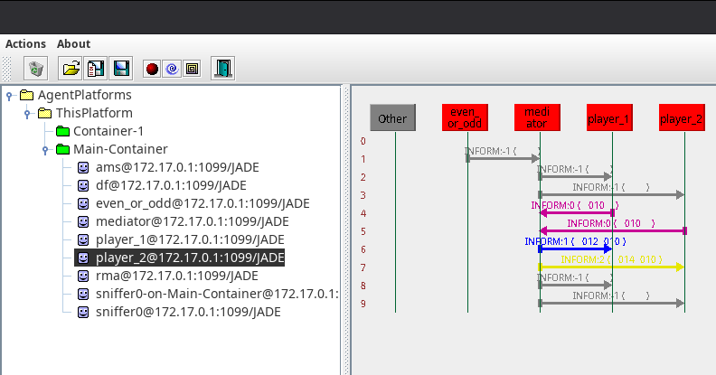
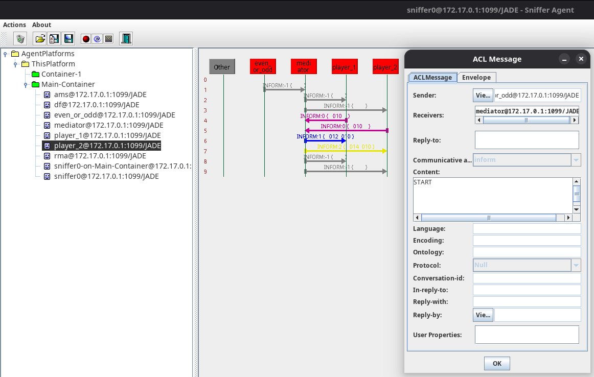
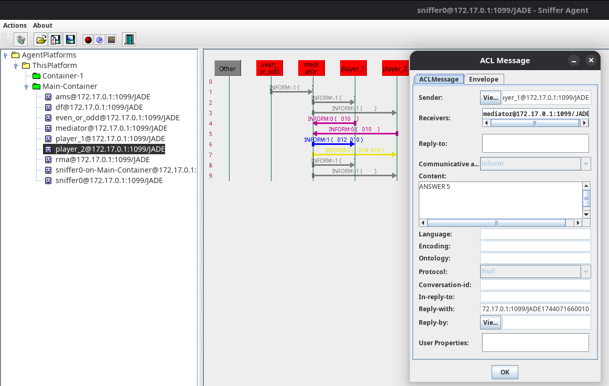
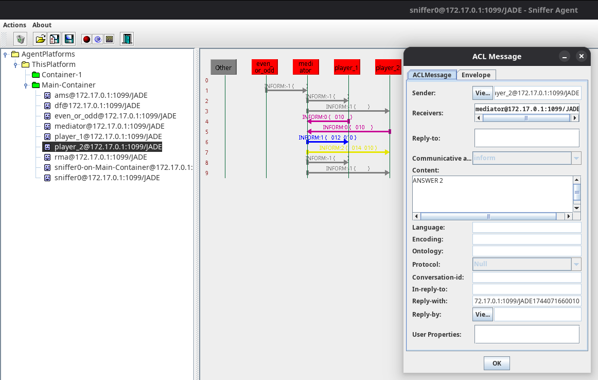
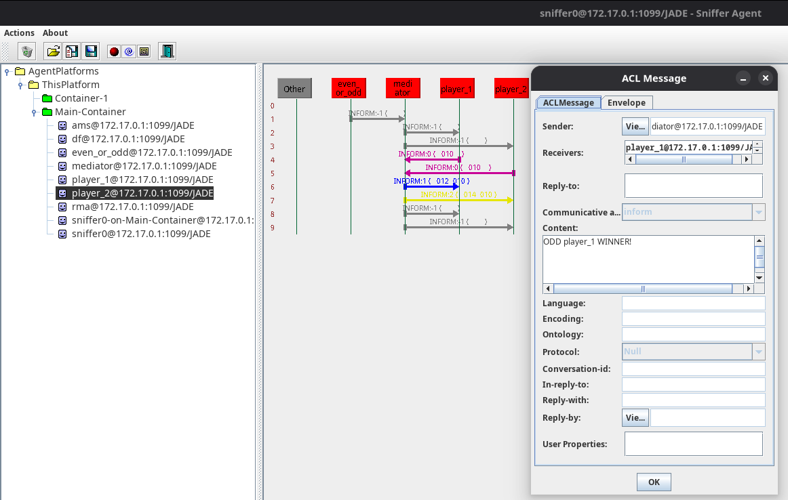

# Par ou Ímpar

## Autores

| **Identificação** | **Nome** | **Formação** |
| :-: | :-: | :-: |
|  | André Corrêa da Silva | Graduando em Engenharia de Software (UnB) |
|  | Gabriel Mariano da Silva | Graduando em Engenharia de Software (UnB) |

*Tabela 1: Identificação dos Autores*

## Descrição

O *building block* contido neste repositório tem por objetivo representar um "Par ou Ímpar", onde duas pessoas visam encontrar um vencedor por meio da verificação se o resultado da soma dos números escolhidos por cada jogador é par ou ímpar. No contexto desse *building block*, cada
jogador é visto como um agente de software e foi inserido um agente mediador, que busca coletar as informações dos agentes e determinar um vencedor.

### Projeto em Execução

Abaixo, é possível ver o uso do *sniffer* da plataforma JADE sobre a comunicação realizada entre os agentes após a execução da aplicação anteriormente descrita.



*Figura 1: Uso do Sniffer para a Visualização da Comunicação entre Agentes*

Dentre as mensagens anteriormente mencionadas, abaixo é possível ver a mensagem de solicitação ao mediador para a realização do Par ou Ímpar, enviada por um agente específico, nomeado por "*even_or_odd*".



*Figura 2: Uso do Sniffer para a Visualização da Mensagem de Solicitação do Par ou Ímpar*

Após a solicitação dos valores do mediador para os agentes participantes do jogo, ambos retornam ao mesmo os números escolhidos, como pode ser visto abaixo nas Figuras 3 e 4.



*Figura 3: Uso do Sniffer para a Visualização da Mensagem com Valor Escolhido pelo Agente Player 1*



*Figura 4: Uso do Sniffer para a Visualização da Mensagem com Valor Escolhido pelo Agente Player 2*

Como pode ser visto acima, o Agente *Player 1* escolheu o número 5, enquanto o Agente *Player 2* escolheu o número 2, totalizando 7 (isto é, um valor ímpar). Como foi definido fixamente que o Agente *Player 1* ganharia caso o valor resultante fosse ímpar (e, consequentemente, o Agente *Player 2* ganharia caso o valor resultante fosse par), tem-se este jogo resultou na vitória do *Player 1*, o que será informado a ambos os agentes através de mensagem específica, exemplificada na figura abaixo.



*Figura 5: Uso do Sniffer para a Visualização da Mensagem Informativa quanto ao Agente Vencedor*

<!-- ## Requisitos Técnicos

Lorem ipsum dolor sit amet, consectetur adipiscing elit. Maecenas in bibendum diam. Vestibulum at sapien sit amet erat malesuada ultrices. Quisque faucibus purus dui. Sed egestas fringilla hendrerit. Nullam rutrum consectetur risus, dapibus tincidunt lorem pellentesque nec. Donec leo eros, euismod a gravida eu, faucibus eget leo. Quisque auctor, enim at hendrerit auctor, dui nulla dictum tortor, a convallis mauris ligula ut quam. Pellentesque dapibus enim libero, ut tristique dolor porta quis. Morbi eget sagittis nunc. Maecenas eget metus bibendum nulla feugiat vulputate. Vestibulum non accumsan eros, vel finibus arcu. Nunc vel convallis mauris. -->

## Requisitos para Execução

Para a efetiva execução do *building block* disposto no repositório, se faz necessária a instalação e configuração do *software* *Maven* em sua máquina. Para tal, basta seguir as instruções de instalação dispostas na [**documentação do *Maven***](https://maven.apache.org/install.html). Para o desenvolvimento do *building block*, foi utilizado o *Maven* na versão **3.8.7**. Além disso, todas as instruções de execução consideram o uso de sistemas operacionais baseados em *Linux*.

## Como Executar?

Para a execução do *building block*, é possível utilizar-se do *Makefile* adicionado ao repositório ao seguir os seguintes passos:

- Primeiramente, clone o repositório em sua máquina:

```bash
git clone https://github.com/SMA-building-blocks/even-or-odd.git
```

- Em seguida, vá para a pasta do repositório:

```bash
cd even-or-odd
```

- Para realizar a *build* do projeto e executá-lo em seguida, execute o seguinte comando:

```bash
make build-and-run
```

> 🚨 **IMPORTANTE:** Ao executar o projeto, primeiro será realizada a criação de todos os agentes participantes. Logo após, para a efetiva realização do propósito desejado pelo *building block*, é necessário pressionar **ENTER** no terminal para a continuidade da execução do código. Esta decisão foi tomada em prol de uma facilitação do uso do *sniffer* para a visualização da comunicação entre os agentes participantes.

- É possível realizar apenas a *build* do projeto com o seguinte comando:

```bash
make build
```

- Similarmente, é possível rodar o projeto após a geração de sua build com o seguinte comando:

```bash
make run
```

- Por fim, para apagar os arquivos derivados da *build* do projeto, execute o seguinte comando:

```bash
make clean
```

## Fontes e Referências

[*Jade Project*](https://jade-project.gitlab.io/). <br />
[*Maven*](https://maven.apache.org/).
